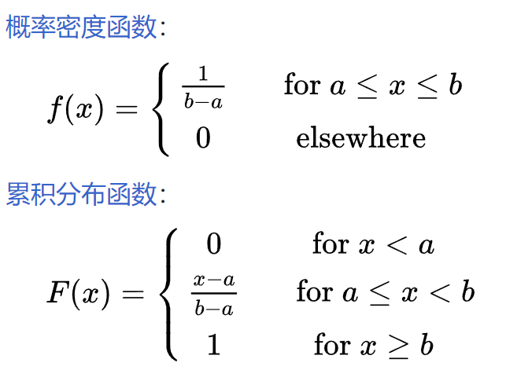
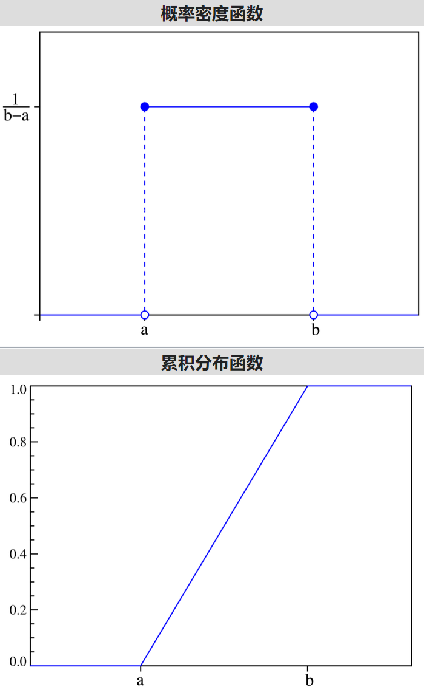
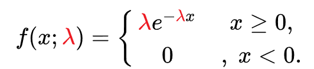
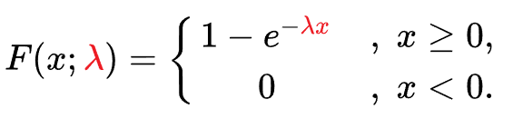

# 概率分布

## 伯努利分布（*Bernoulli distribution*）

又名**两点分布**或者**0-1分布**，是一个[离散型概率分布](https://zh.wikipedia.org/wiki/概率分布#离散分布)。

若[伯努利试验](https://zh.wikipedia.org/wiki/伯努利試驗)成功，则伯努利[随机变量](https://zh.wikipedia.org/wiki/隨機變量)取值为1。若伯努利试验失败，则伯努利[随机变量](https://zh.wikipedia.org/wiki/隨機變量)取值为0。记其成功[概率](https://zh.wikipedia.org/wiki/概率)为p(0≤p≤1)，失败[概率](https://zh.wikipedia.org/wiki/概率)为q=1−p。

| 项   | 值    |
| ---- | ----- |
| 参数 | 0<p<1 |
| 期望 | p     |
| 方差 | pq    |

## 二项分布（binomial distribution）

（n次[独立](https://zh.wikipedia.org/wiki/独立_(概率论))[伯努利试验](https://zh.wikipedia.org/wiki/伯努利試驗)）

描述在进行[独立](https://zh.wikipedia.org/wiki/独立_(概率论))[随机试验](https://zh.wikipedia.org/wiki/随机试验)时，每次试验都有相同[概率](https://zh.wikipedia.org/wiki/概率)“成功”的情况下，获得成功的总次数。

一般用二项分布来计算概率的前提是，每次抽出样品后再放回去，并且只能有两种试验结果，比如黑球或红球，正品或次品等。[掷硬币](https://zh.wikipedia.org/wiki/擲硬幣)十次出现五次正面的概率、产品合格率99%时抽出一百件样本没有发 现一件次品的概率等等，都可以由二项分布给出。

| 项   | 值          |
| ---- | ----------- |
| 参数 | n>0,0<=p<=1 |
| 期望 | np          |
| 方差 | np(1-p)     |
| 记号 | B~(n,p)     |
|      |             |

9.13    18:46看到第4集 21:50

## 均匀分布

## 指数分布

## 正态分布

