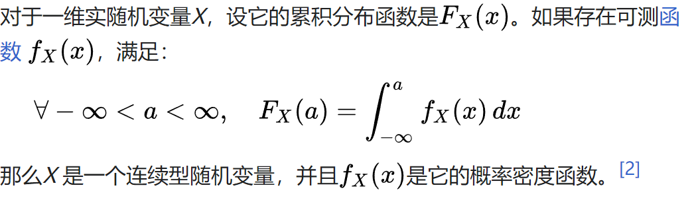
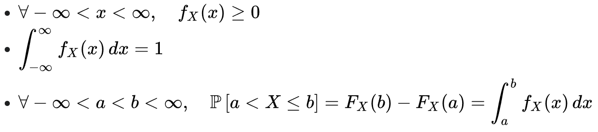
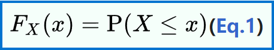

# 概率密度函数和累积分布函数

## **概率密度函数**（**P**robability **d**ensity **f**unction）

简写作**PDF**。是描述[随机变量](https://zh.wikipedia.org/wiki/随机变量)的输出值，在某个确定的取值点附近的可能性的[函数](https://zh.wikipedia.org/wiki/函数)。

#### [概率质量函数](https://zh.wikipedia.org/wiki/概率质量函数)(PMF)

PMF 用于离散随机变量（在可数集上取值的随机变量），而 PDF 用于连续随机变量。

### 定义

### 性质

## [累积分布函数](https://zh.wikipedia.org/wiki/累积分布函数)（英语：cumulative distribution function）

简写作**CDF**。是概率密度函数的积分。

### 定义

### 性质

