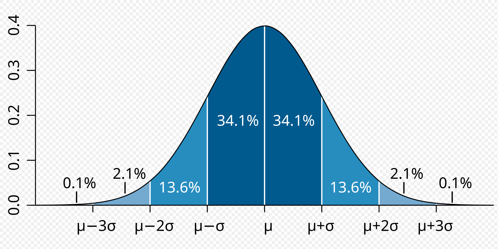

| [统计学](https://zh.wikipedia.org/wiki/统计学)系列条目       |
| ------------------------------------------------------------ |
| [概率论](https://zh.wikipedia.org/wiki/概率论)               |
|  |
| [概率](https://zh.wikipedia.org/wiki/概率)  \|   [概率公理](https://zh.wikipedia.org/wiki/機率公設)  \|  [决定论](https://zh.wikipedia.org/wiki/決定論)  \|  [非决定论](https://zh.wikipedia.org/wiki/非決定論)  \|  [随机性](https://zh.wikipedia.org/wiki/随机性) |
| [概率空间](https://zh.wikipedia.org/wiki/機率空間)   \|  [概率测度](https://zh.wikipedia.org/wiki/概率测度)  \|  [样本空间](https://zh.wikipedia.org/wiki/样本空间)  \|  [随机试验](https://zh.wikipedia.org/wiki/随机试验)   \|  [伯努利试验](https://zh.wikipedia.org/wiki/伯努利試驗)[事件](https://zh.wikipedia.org/wiki/事件_(概率论))   \|  [互补事件](https://zh.wikipedia.org/wiki/互補事件)  \|  [互斥](https://zh.wikipedia.org/wiki/互斥)  \|  [基本事件](https://zh.wikipedia.org/w/index.php?title=基本事件&action=edit&redlink=1)  \|  [结果](https://zh.wikipedia.org/wiki/结果_(随机试验))  \|  [单元素](https://zh.wikipedia.org/wiki/单元素集合) |
| [随机变量](https://zh.wikipedia.org/wiki/随机变量) [期望](https://zh.wikipedia.org/wiki/期望值)  \|  [条件概率](https://zh.wikipedia.org/wiki/条件概率)  \|  [概率分布](https://zh.wikipedia.org/wiki/概率分布)   \|  [离散型均匀分布](https://zh.wikipedia.org/wiki/離散型均勻分佈)  \|  [伯努利分布](https://zh.wikipedia.org/wiki/伯努利分布)  \|  [二项式分布](https://zh.wikipedia.org/wiki/二項式分布)  \|  [几何分布](https://zh.wikipedia.org/wiki/幾何分佈)  \|  [负二项分布](https://zh.wikipedia.org/wiki/负二项分布)  \|  [超几何分布](https://zh.wikipedia.org/wiki/超几何分布)  \|  [泊松分布](https://zh.wikipedia.org/wiki/泊松分布)  \|  [连续型均匀分布](https://zh.wikipedia.org/wiki/连续型均匀分布)  \|  [正态分布](https://zh.wikipedia.org/wiki/正态分布)  \|  [对数正态分布](https://zh.wikipedia.org/wiki/对数正态分布)  \|  [多元正态分布](https://zh.wikipedia.org/wiki/多元正态分布)  \|  [指数分布](https://zh.wikipedia.org/wiki/指数分布)  \|  [Gamma分布](https://zh.wikipedia.org/wiki/Gamma分布)  \|  [Beta分布](https://zh.wikipedia.org/wiki/Beta分布)  \|  [帕累托分布](https://zh.wikipedia.org/wiki/帕累托分布)  \|  [联合分布](https://zh.wikipedia.org/wiki/联合分布)  \|  [边缘分布](https://zh.wikipedia.org/wiki/%E8%BE%B9%E7%BC%98%E5%88%86%E5%B8%83) |
| [随机过程](https://zh.wikipedia.org/wiki/随机过程)   \|  [伯努利过程](https://zh.wikipedia.org/wiki/伯努利过程)  \|  [随机游走](https://zh.wikipedia.org/wiki/隨機漫步)  \|  [维纳过程](https://zh.wikipedia.org/wiki/维纳过程)  \|  [马尔可夫过程](https://zh.wikipedia.org/wiki/馬可夫過程)  \|  [伊藤过程](https://zh.wikipedia.org/wiki/伊藤過程) |
| [统计独立性](https://zh.wikipedia.org/wiki/独立_(概率论))  \|  [条件独立](https://zh.wikipedia.org/wiki/条件独立)  \|  [全概率公式](https://zh.wikipedia.org/wiki/全機率定理)  \|  [大数定律](https://zh.wikipedia.org/wiki/大數法則)  \|  [贝叶斯定理](https://zh.wikipedia.org/wiki/贝叶斯定理)  \|  [布尔不等式](https://zh.wikipedia.org/wiki/布尔不等式) |
| [文氏图](https://zh.wikipedia.org/wiki/文氏图)[树形图](https://zh.wikipedia.org/wiki/樹形圖) |